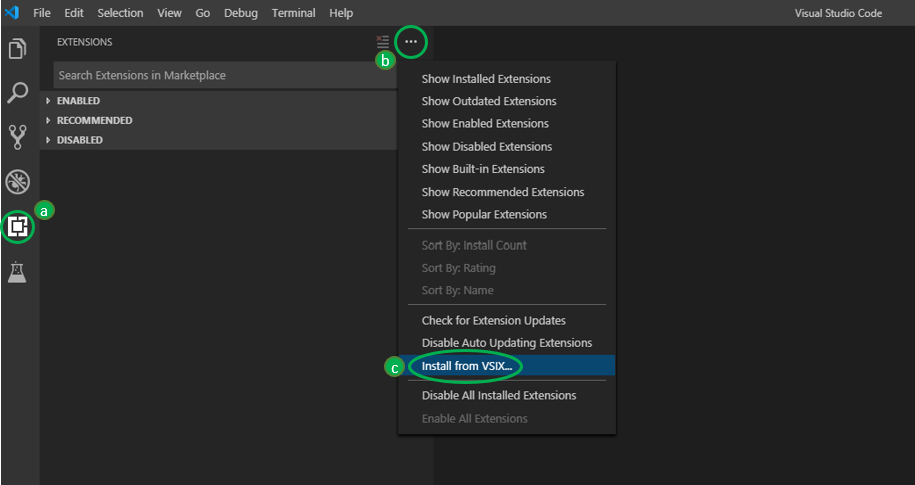

# Instructions on How to Install and Run the Extension

## Steps to manually install the extension

1. Link to the latest releases :
   [Releases](https://github.com/microsoft/vscode-python-embedded/releases)
2. Click on the latest release
3. At the bottom of the page download the .vsix file
4. To install the .vsix file :
   - Go to the directory where the downloaded vsix file is and run in a command console: `code --install-extension <vsix file name>`
   - Or in VS Code, go to the extension tab (a), in menu (b) select 'Install from VSIX' (c) and search the file you downloaded
     

## Prerequisites

_Note: You need to install all the dependencies in order to use the extension._

- [VS Code](https://code.visualstudio.com/Download)
- [Node](https://nodejs.org/en/download/)
- [Python 3.7.4](https://www.python.org/downloads/)
  - **Warning :** Make sure you've included `python` (or `python3.7`) and `pip` to your `PATH` in your **environment variables**.  
    _(Note: the easiest way to do it might be when you install Python, you can select the "Add to PATH" option directly. Otherwise you can search how to insert it manually, but make sure that when you type `python` (or `python3.7`) in a terminal, the command is recognized.)_
- [Python VS Code extension](https://marketplace.visualstudio.com/items?itemName=ms-python.python)
  - **Note:** This extension is installed automatically from the marketplace when you install our extension
  
* Python Modules
  - **Note:** On extension activation, you will be prompted with a popup asking if you want the modules to be automatically installed for you. The following python modules should be downloaded when you select "yes" on the prompt message. **If modules are not installed correctly, please use the "pip install" commands listed below.**
    - pywin32 **(on Windows only)**: `pip install pywin32`
        - On Windows, you need to use the above command in the console to manually install pywin32.
    - *playsound*: `pip install playsound`
    - *pytest*: `pip install pytest`
    - *python-socketio*: `pip install python-socketio`
    - *requests*: `pip install requests`
    - *applicationinsights*: `pip install applicationinsights`

    *italics*: used in simulation mode only
## How to use the Extension

- [How to use the Extension](/docs/how-to-use.md)
