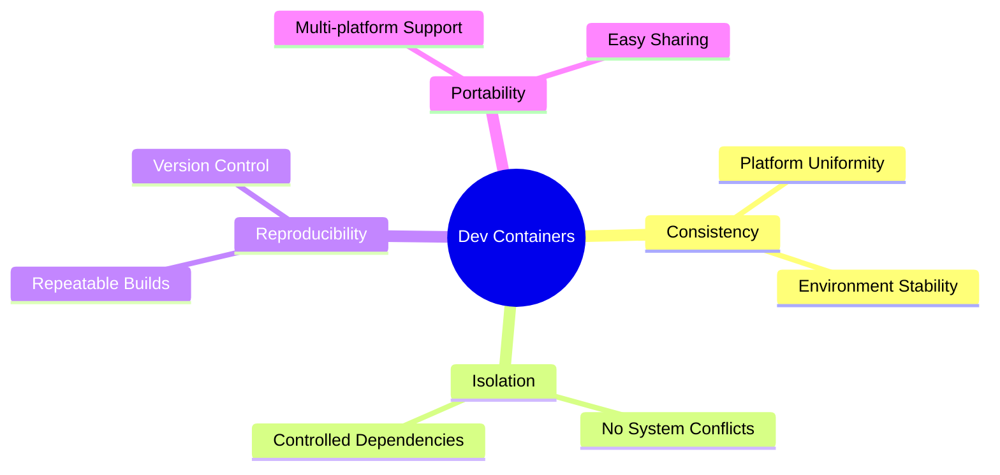

# 🛠️ DevContainer Project Templates

Welcome to the **DevContainer Project Templates** repository! This collection features ready-to-use project templates
designed to simplify your development environment setup using DevContainers. Whether you're working with frontend,
backend, fullstack, or even experimenting with new technologies, these templates provide standardized configurations
that ensure consistency across different machines and platforms.

## 🚀 What are DevContainers?

Dev containers are isolated, lightweight environments that provide a pre-configured development environment inside your
editor or IDE. They save time by eliminating the need for manual setup and ensure a clean environment every time. Dev
containers offer benefits such as pre-configured build environments, isolated environments, reproducible builds, less
setup time, and flexibility in choosing base images.



## **⚙️ Advantages of Dev Containers**

Development containers offer a standardized solution for creating identical development environments for all developers,
reducing inconsistency problems and facilitating portability across different platforms. Thanks to the complete
isolation they offer, they avoid conflicts between different system configurations and ensure that every developer works
in a uniform environment, whatever the differences between their local machines.

|                              | **🔒 Dev Containers**                       | **🖥️ Local Environments**                | **💻 Virtual Machines (VMs)**                        |
|------------------------------|---------------------------------------------|-------------------------------------------|------------------------------------------------------|
| **🔄 Consistency**           | Identical environments for everyone         | Risk of inconsistencies between machines  | Consistent if well-configured, but heavy             |
| **🛡️ Isolation**            | Strong isolation through containerization   | Low, depends on system configurations     | Good isolation, but less flexible                    |
| **🧩 Reproducibility**       | Easily reproducible via configuration files | Complex to reproduce manually             | Reproducible but requires more resources             |
| **🌐 Portability**           | High portability across different platforms | Low, depends on the operating system      | Limited portability to compatible environments       |
| **⚙️ Ease of Configuration** | Automated with scripts and configurations   | Manual, can be complex                    | Requires advanced configurations                     |
| **⚡ Performance**            | Lightweight and performant                  | Performant but depends on local resources | Less performant, depends on the VM                   |
| **⏱️ Setup Time**            | Fast thanks to predefined configurations    | Long to install and configure             | Long due to the creation and configuration of the VM |

## 💼 Use Cases of Dev Containers

Dev containers are particularly useful in the following scenarios:

- **Team Collaboration:** Ensure all team members have the same development environment, regardless of their local
  setup.
- **Onboarding New Developers:** Simplify the onboarding process by providing a consistent environment for new team
  members.
- **Open Source Projects:** Facilitate contributions by providing a standardized environment for contributors.
- **Experimenting with New Technologies:** Quickly set up an isolated environment for testing new tools or frameworks.
- **Continuous Integration/Continuous Deployment (CI/CD):** Use dev containers to ensure consistent builds across
  different stages of the pipeline.
- **Education and Training:** Provide students with a consistent environment for learning and practicing coding.
- **Hackathons and Workshops:** Set up dev containers for participants to ensure a level playing field during the event.
- **Freelance Projects:** Maintain a consistent development environment across different client projects.
- **Personal Projects:** Use dev containers to keep your local machine clean and organized for personal coding projects.
- **Remote Work:** Ensure that all team members have the same development environment, regardless of their location.
- **Cross-Platform Development:** Develop applications that can run on different operating systems without compatibility
  issues.
- **Security and Compliance:** Use dev containers to ensure that all development environments meet security and
  compliance standards.

## 📂 Available Templates

> ⚠️ **Note:** This repository is a work in progress. New templates will be added regularly as the collection evolves.

| Project Name                            | Description                                                                                                                                           | Versions                                                   | Link                                                                       |
|-----------------------------------------|-------------------------------------------------------------------------------------------------------------------------------------------------------|------------------------------------------------------------|----------------------------------------------------------------------------|
| **Java 17 with Gradle**                 | A Java project template using Gradle for dependency management and building, ideal for both simple and complex Java applications.                     | Java 17, Gradle 8.8                                        | [Java 17 with Gradle Template](/templates/java-gradle)                     |
| **Java 21 with Maven**                  | A modern Java project template using Maven for dependency management and building, configured for advanced and enterprise-level Java development.     | Java 21, Maven 3.9.4                                       | [Java 21 with Maven Template](/templates/java-maven)                       |
| **Spring Boot with Java 17 and Gradle** | A Spring Boot project template using Gradle 8.8 and PostgreSQL 14, ideal for backend applications needing modern Java and robust database management. | Java 17, Gradle 8.8, PostgreSQL 14                         | [Spring Boot with Java 17 Template](/templates/spring-postgres)            |
| **Spring Boot + Angular + PostgreSQL**  | A fullstack template combining a Spring Boot backend with Angular 18 frontend and PostgreSQL database for robust web applications.                    | Java 17, Gradle 8.8, Angular 18, Node.js 20, PostgreSQL 14 | [Spring + Angular + Postgres Template](/templates/spring-angular-postgres) |
## 📦 Prerequisites

- [Docker](https://docs.docker.com/get-docker/) or similar container runtime (e.g. Podman, OrbStack)
- [Compose](https://docs.docker.com/compose/install/) or similar container orchestration tool (e.g. Podman Compose)
- [Visual Studio Code](https://code.visualstudio.com/)
- [DevContainers Extension](https://marketplace.visualstudio.com/items?itemName=ms-vscode-remote.remote-containers)

## 🛠️ How to Use the Templates

1. **Clone the Repository:**
    ```bash
    git clone https://github.com/alarboulletmarin/devcontainers-templates.git
    cd devcontainer-templates
    ```

2. **Choose a Template:**
   Navigate to the directory of the template you wish to use. Each template is in its own folder with relevant
   configuration files (`devcontainer.json`, `Dockerfile`, etc.).

3. **Open the Project in Your Editor:**
   Open the template folder in Visual Studio Code or any IDE that supports DevContainers. The editor should
   automatically detect the DevContainer setup and prompt you to reopen the project inside the container.

4. **Start Coding:**
   Once the container is ready, you can immediately start coding with all the pre-configured tools, extensions, and
   settings.

## 📖 Project Structure

Each template follows a consistent structure:

```
template-name/
│── .devcontainer/
│   ├── devcontainer.json
│   ├── Dockerfile (if applicable)
│   ├── docker-compose.yml (if applicable)
│── src/
│   ├── main project code
└── README.md (template-specific documentation)
```

## ✨ Why Use These Templates?

- **Consistency:** Ensure all developers have the same environment, reducing the classic "it works on my machine"
  issues.
- **Portability:** Quickly move between different projects and environments without manual setup.
- **Productivity:** Spend less time configuring your tools and more time coding.

## 📄 Contributing

We welcome contributions! If you have a template you'd like to add or improvements to existing ones, feel free to submit
a pull request.

1. Fork the repository.
2. Create a new branch.
3. Add your template in a new folder.
4. Submit a pull request with a detailed explanation of your template.

## 📝 License

This project is licensed under the MIT License - see the [LICENSE](LICENSE) file for details.
